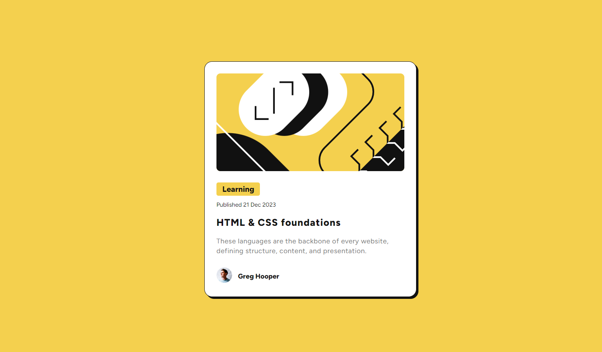

# Frontend Mentor - Solución "02 - Blog Preview Card"

Esta es una solución al desafío "03 - Blog Preview Card" en Frontend Mentor.

## Tabla de contenidos

- [Visión general](#visión-general)
  - [El desafío](#el-desafío)
  - [Captura de pantalla](#captura-de-pantalla)
  - [Enlaces](#enlaces)
- [Mi proceso](#mi-proceso)
  - [Construido con](#construido-con)
  - [Lo que aprendí](#lo-que-aprendí)
  - [Recursos útiles](#recursos-útiles)
- [Autor](#autor)
- [Agradecimientos](#agradecimientos)

## Visión general

### El desafío

El desafío consiste en desarrollar una tarjeta de vista previa a un blog utilizando HTML y CSS.

### Captura de pantalla

### Enlaces

- URL del sitio en vivo: [03 - Blog Preview Card](https://galaxypliego.github.io/frontend-mentor-challenges/03-blog-preview-card-main/)

## Mi proceso

### Construido con

- HTML5
- CSS personalizado
- Flexbox
- [Normalize.css](https://necolas.github.io/normalize.css/) - Para una mejor consistencia entre navegadores

### Lo que aprendí

Al trabajar en este proyecto, aprendí cómo organizar un diseño de perfil con enlaces sociales, implementando Flexbox para una estructura de diseño adaptable. Esto también me permitió experimentar con el uso de `normalize.css` para lograr una mayor consistencia visual en diferentes navegadores.

### Recursos útiles

- [Normalize.css](https://necolas.github.io/normalize.css/) - Una hoja de estilo para normalizar el estilo predeterminado de los navegadores.

## Autor

- Frontend Mentor - [@galaxypliego](https://www.frontendmentor.io/profile/galaxypliego)

## Agradecimientos

Agradezco a la comunidad de Frontend Mentor por los recursos compartidos, que me ayudaron a inspirarme y superar los desafíos de diseño.