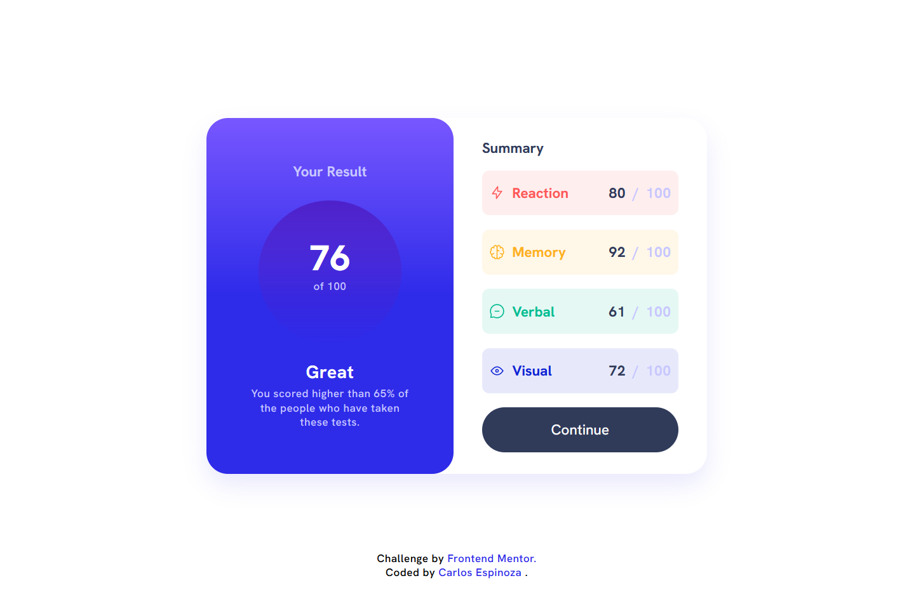
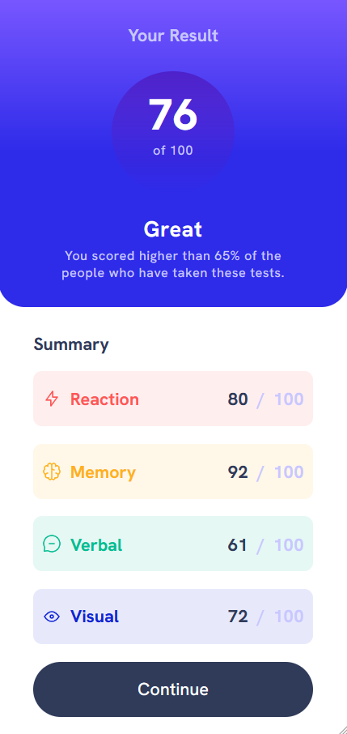

# Frontend Mentor - Solución "05 - Results Summary Component"

Esta es una solución al desafío "05 - Results Summary Component.

## Tabla de contenidos

- [Visión general](#visión-general)
  - [El desafío](#el-desafío)
  - [Captura de pantalla](#captura-de-pantalla)
  - [Enlaces](#enlaces)
- [Mi proceso](#mi-proceso)
  - [Construido con](#construido-con)
  - [Lo que aprendí](#lo-que-aprendí)
  - [Recursos útiles](#recursos-útiles)
- [Autor](#autor)
- [Agradecimientos](#agradecimientos)

## Visión general

### El desafío

El desafío consiste en desarrollar una acordeón de preguntas frecuentes utilizando HTML, CSS y Javascript.

### Captura de pantalla

### Enlaces

- URL del sitio en vivo: [04 - Faq Accordion Demo](https://carlos-espipliego.github.io/frontend-mentor-challenges/04-faq-accordion-main/)

## Mi proceso

### Construido con

- HTML5
- CSS personalizado
- Flexbox
- [Normalize.css](https://necolas.github.io/normalize.css/) - Para una mejor consistencia entre navegadores

### Lo que aprendí

Al trabajar en este proyecto, aprendí a mejorar mis habilidades en la creación de componentes interactivos utilizando HTML y CSS

### Recursos útiles

- [Normalize.css](https://necolas.github.io/normalize.css/) - Una hoja de estilo para normalizar el estilo predeterminado de los navegadores.
- [BEM](http://getbem.com/) - Una metodología de nomenclatura de clases CSS que ayuda a mantener el código más organizado y escalable.

## Autor

- Frontend Mentor - [@carlos-espipliego](https://www.frontendmentor.io/profile/carlos-espipliego)

## Agradecimientos

Agradezco a la comunidad de Frontend Mentor por los recursos compartidos, que me ayudaron a inspirarme y superar los desafíos de diseño.